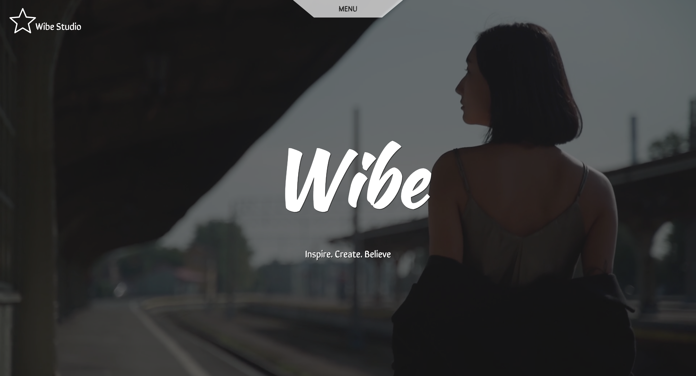

   
      
   

  

    
    
    
    
  

  <h3 align="center">A UI Inspired Fashion Webpage</h3>

## 📋 <a name="table">Table of Contents</a>

1. 🤖 [Introduction](#introduction)
2. ⚙️ [Tech Stack](#tech-stack)
3. 🔋 [Features](#features)
4. 🔑 [Key Components](#key-components)

## <a name="introduction">🤖 Introduction</a>

A visually stunning fashion website designed to showcase an elegant collection of beautiful clothes. The website features trendsetting styles and sophisticated outfits, providing users with a delightful browsing experience.

## <a name="tech-stack">⚙️ Tech Stack</a>

- React
- CSS (Styled Components)
- Framer Motion - for smooth animations
- GSAP (GreenSock Animation Platform) - for advanced scroll-triggered animations

## <a name="features">🔋 Features</a>

👉 **Elegant Design**: Showcases a collection of fashionable clothes with an emphasis on aesthetics.

👉 **Responsive Layout**: Ensures a seamless viewing experience across different devices.

👉 **Animated Elements**: Utilizes motion graphics to enhance user engagement and visual appeal.

and many more

## <a name="key-components">🔑 Key Components</a>
👉 **Home: Main landing page integrating core elements of the application**:

1) CoverVideo: Full-screen video background.

2) Navbar: Responsive navigation bar.

3) Logo: Animated logo.

👉 **Marquee: Dynamic text animation effect with styled components and scroll attributes**

👉 **Footer**:

1) LogoContainer: Displays the logo and studio name.

2) FooterComponent: Navigation menu with hover effects and responsive design.

3) Bottom: Copyright information and credits.

👉 **About**: Details the studio's philosophy and offerings.

1) Left: Text section with responsive design.

2) Right: Image gallery with varying sizes and scroll speeds.

👉 **Assets**:
1) Images: Product images and other visual assets.
2) Svgs: SVG icons and graphics.
3) Video: Video files such as Walking Girl.mp4.

👉 **Styles**:
1) GlobalStyles.js: Defines global CSS styles including font settings, layout adjustments, and scroll behavior.
2) Themes.js: Contains theme definitions for light and dark modes with color schemes and font sizes.
